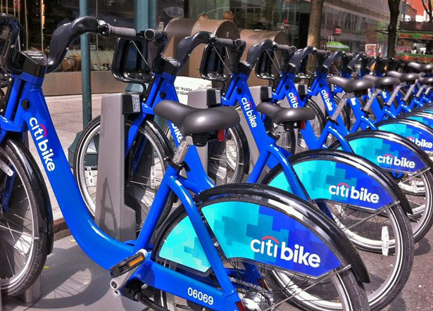

# Assignment - Citi Bike Analytics

## Data Preparation

The raw data file is from [New York Citi Bike](https://en.wikipedia.org/wiki/Citi_Bike) Program. In order to download all files from https://s3.amazonaws.com/tripdata/index.html, I created a Jupyter Notebook:

[CitiBike-Load-To-Redshift.ipynb](CitiBike-Load-To-Redshift.ipynb)

The resulting data are stored in a single Redshift table citi_trips with around 60 million records, the Tableau visuzliatrion is conducted based on this table.

## Visualizations and Analysis

### Dashboard "Trip and Growth"

This dash board answers following questions:

* How many trips have been recorded total during the chosen period?
* By what percentage has total ridership grown? 

###  How has the proportion of short-term customers and annual subscribers changed?

### Dashboard "Peaks"

* Today, what are the peak hours in which bikes are used during summer months? 
* Today, what are the peak hours in which bikes are used during winter months?

### Dashboard "Top/Bottom Stations"
* Today, what are the top 10 stations in the city for starting a journey? (Based on data, why do you hypothesize these are the top locations?)
* Today, what are the top 10 stations in the city for ending a journey? (Based on data, why?)
* Today, what are the bottom 10 stations in the city for ending a journey (Based on data, why?)
* Today, what is the gender breakdown of active participants (Male v. Female)?

### Dashboard "Gender"
* How effective has gender outreach been in increasing female ridership over the course of the past three years?
* How does the average trip duration change by age?

### Dashboard "Duration/Distance"
* What is the average distance in miles that a bike is ridden?

### Dashboard "Bike Status Dashboard"

* Which Bikes (by ID) are most likely due for repair or inspection this year? 
* How variable is the utilization by bike ID?

### Dashboard "Maps"

* A static map that plots all bike stations with a visual indication of the most popular locations to start and end a journey with zip code data overlaid on top.
* A dynamic map that shows how each station's popularity changes over time (by month and year) -- with commentary pointing to any interesting events that may be behind these phenomena.

### Find at least two unexpected phenomena in the data and provide a visualization and analysis to document their presence. 

* Top 3 station pair (start/end) with most trips all has bike returned to the same station. The most popular one is at Central Park and 6th Avenue. Estimate of travel distance will be a challenge for trips end at same station.

* In 2016 and 2017, there are some bikes with zero duration but non-zero distance. This need to be insvestigated. Then I found some station pairs with extremly long distance. Many of then are from or to stations call "Don't Use"
* What are those "Don't Use" stations, and why there are trips associated with them?

